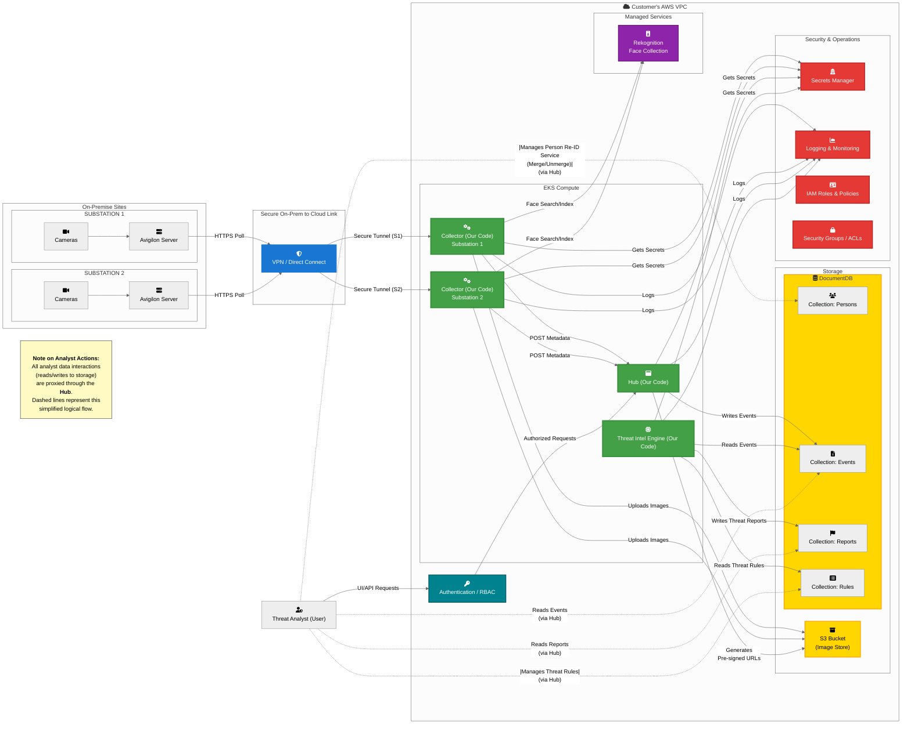

## Duke Advanced Threat Intelligence Platform

### Functional Overview

- **Ingestion & Enrichment:** A Collector polls Avigilon for event data, uploads associated images directly to S3, and enriches event metadata with face signatures from AWS Rekognition.  
- **Persistence for Analysis:** A central Hub receives the complete metadata package (including S3 image links and Rekognition results) from the Collector and persists it to the database, preparing the data for analysis.  
- **Batch Analysis & Reporting:** The Threat Intel Engine runs as an independent batch process. It periodically queries the database for new events, performs analysis, and writes resulting Anomaly Reports back to the database.  
- **Consumption:** The Hub’s UI provides a unified interface for Threat Analysts to access raw events, curated identities, and final Anomaly Reports from the database.

---

### System Diagram

