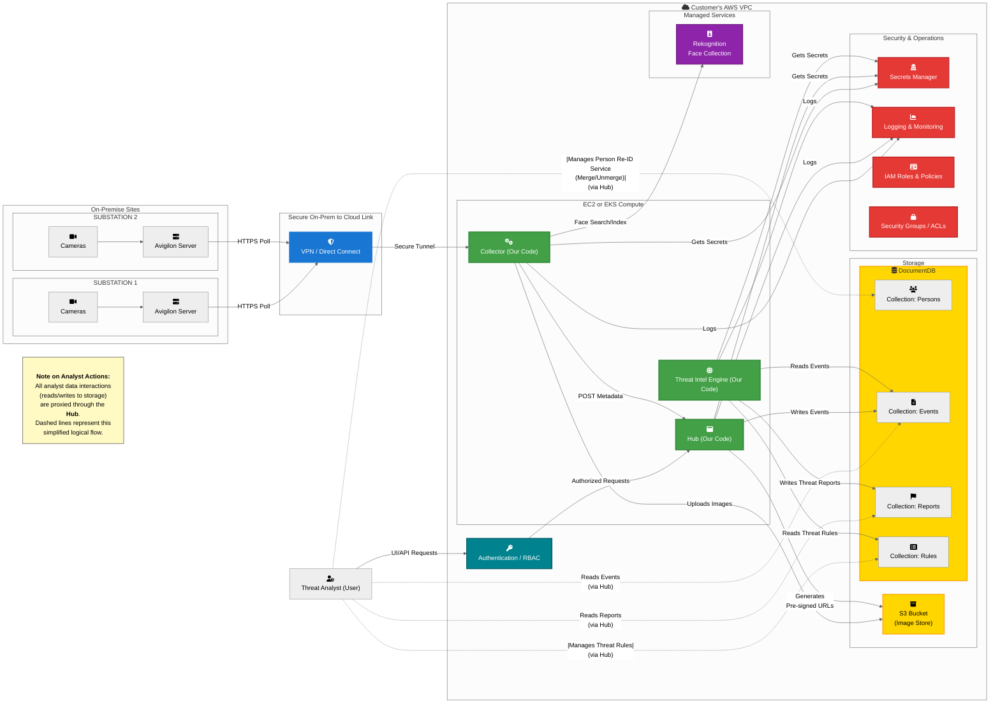

# Threat Intelligence Platform

## Overview
- **Ingestion & Enrichment:** A Collector polls Avigilon for event data, uploads the associated image directly to S3, and enriches the event metadata with a face signature from AWS Rekognition.
- **Persistence for Analysis:** A central Hub receives the complete metadata package (including the S3 image link and Rekognition results) from the Collector and persists it to the database, staging the data for the analysis engine.
- **Batch Analysis & Reporting:** The Threat Intel Engine operates as an independent batch process. It periodically queries the database for new events, performs its analysis, and writes the resulting Anomaly Reports directly back to the database.
- **Consumption:** Finally, the Hub's UI provides a unified view, allowing Threat Analysts to consume the raw events, curated identities, and final Anomaly Reports from the database.

### Phase 2 Enhancements (TODO)

- **Enterprise Authentication Integration:** Connect the RBAC service to an external identity provider (e.g., SAML, OIDC) for single sign-on.
- **Dedicated Image Storage:** Store images in an AWS S3 bucket instead of MongoDB for cost-effective and scalable storage.
- **Person Identity Management UI:** Interface within the Hub for analysts to merge, unmerge, and curate person identities in the re-identification collection.
- **Rules Engine Management UI:** Allow analysts to create, edit, and manage deterministic rules via the Hub interface.

### Post–Phase 2 PoV (Scaling Beyond 2 Sites)

- **Collector Management UI:** A section in the Hub to register new collectors, monitor their status, and manage site configurations.
- **(Tentative): Scalability with Message Queues:** Refactor the internal data flow to use a message queue (e.g., Amazon SQS) to enable horizontal scaling beyond two sites. This decouples data ingestion from processing, improving reliability and throughput under load. Estimated effort: **1–2 weeks**.
---

### System Diagram

### System Architecture & IT Integration FAQ

This document outlines the deployment and integration of our software within your AWS environment. Our model is to provide you with the **source code** for our platform (Collector, Hub, Threat Intel Engine), which is then deployed and run **entirely within your own AWS account**. You maintain full control over the infrastructure, data, and security. Our role is to partner with your teams to ensure a successful integration.

---

#### **1. Network & Connectivity**

*   **On-Prem to Cloud Connection:**
    *   Communication from the on-premise Collector (running in your AWS account) to your Avigilon servers is conducted securely over **HTTPS (port 443)**.
    *   This traffic leverages your existing, approved network infrastructure (e.g., VPN, Direct Connect).

*   **Bandwidth Consumption:**
    *   The Collector polls for **image snapshots (~150KB per image) and metadata**, not full video streams, to minimize bandwidth usage on your network links.
    *   We will conduct a discovery process during the initial engagement to provide a precise bandwidth consumption estimate based on your specific configuration.

*   **Latency Sensitivity:**
    *   The system is designed for **batch processing** and is not highly sensitive to network latency.
    *   Should real-time or near-real-time processing become a requirement, we will review architectural options to meet those needs.

*   **Firewall & Security Groups:**
    *   We will collaborate with your network and cloud teams to define the necessary firewall rules and AWS Security Group / Network ACL configurations within your environment.

---

#### **2. Cloud Infrastructure & Scalability**

*   **Compute Platform (EC2 vs. EKS):**
    *   Our software is flexible and can be deployed on either **EC2 virtual machines or as containers within an EKS cluster** inside your AWS environment, according to your operational standards.

*   **Scalability:**
    *   For the initial **Proof of Value (PoV), an external message queue is not required**. The Collector communicates directly with the Hub, a flow designed to support up to two collection sites.
    *   To enable **horizontal auto-scaling or to expand beyond two sites**, the architecture incorporates an external message queue (e.g., AWS SQS). This is a planned enhancement that requires a minor refactoring effort (~2 weeks).

*   **Infrastructure as Code (IaC) & CI/CD:**
    *   The platform's deployment will integrate with your existing IaC (e.g., Terraform, CloudFormation) and CI/CD pipelines. We provide the application **source code**, and your teams will manage the build and deployment process, ensuring it meets all internal standards.

---

#### **3. Security & Compliance**

*   **Data Encryption & Code Scanning:**
    *   All data is **encrypted in transit (using TLS) and at rest** using the native AWS encryption services you have configured for S3, DocumentDB, etc.
    *   Since you will have the **full source code**, you can integrate it directly into your standard Static Analysis Security Testing (SAST) and vulnerability scanning pipelines before any deployment.

*   **Identity & Access Management:**
    *   We will provide guidance for defining granular **IAM policies that adhere to the Principle of Least Privilege**. Your security team will implement and manage these policies within your AWS account.
    *   On-premise credentials will be managed using your corporate standard, such as **AWS Secrets Manager** or another approved secrets vault within your account.

*   **PII & Data Governance:**
    *   Because the platform runs **entirely within your AWS account**, you retain 100% ownership and control of your data at all times. The system operates under your organization's established data governance and PII policies.

---

#### **4. Database & Data Management**

*   **Database Choice:**
    *   A MongoDB-compatible database (DocumentDB) is recommended for its flexibility in handling the semi-structured nature of event and report data. The final choice of database service is up to you.

*   **Backup and Recovery Strategy:**
    *   Your teams will manage the backup and recovery procedures according to your corporate standards.
    *   **Stateful Data:** The primary backup targets are the S3 bucket (images) and the DocumentDB database (metadata, reports).
    *   **Rekognition Collection:** The Rekognition Face Collection is treated as ephemeral. Resilience is achieved by assigning a stable, unique ID to each identity within your database. If the collection must be rebuilt, the face images from S3 are simply re-indexed.

---

#### **5. Operations & Maintenance**

*   **Deployment & Patching:**
    *   Your IT Operations team will manage the full operational lifecycle of the platform. We will provide guidance and support to align our software with your established processes for deployment, health monitoring, and system patching.

*   **Monitoring & Logging:**
    *   Our software will be configured to produce **structured logs (e.g., JSON)** that can be ingested by your enterprise logging and monitoring tools (e.g., Splunk, AWS CloudWatch Logs), which your teams will manage.
