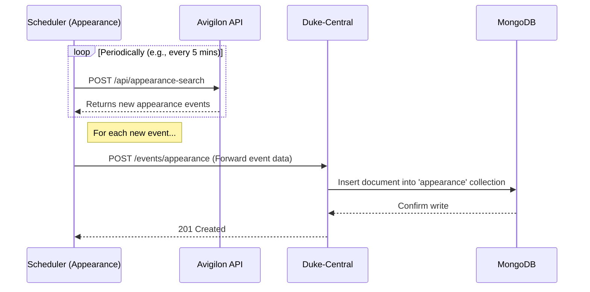
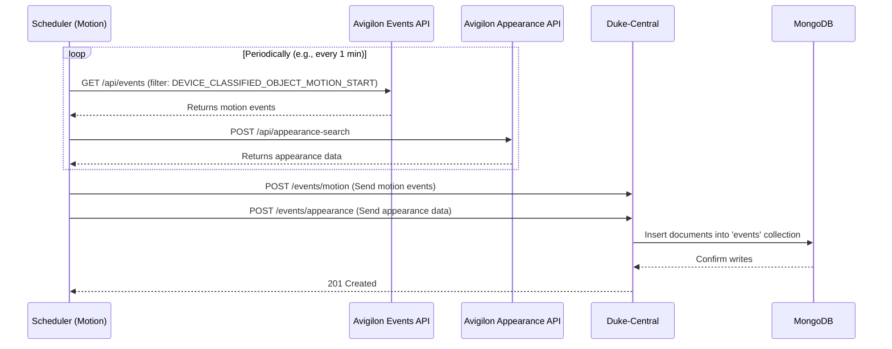

# Technical Avigilon API Data Flow

This document details the hybrid data ingestion strategy used by the `Duke-Backend` service to pull data from the Avigilon system. It is intended for personnel familiar with the Avigilon platform and its APIs.

## 1. Overview of the Hybrid Ingestion Strategy

Our system utilizes two parallel, independent schedulers to ingest data from two distinct Avigilon API endpoints. This hybrid approach is designed to balance data quality with event volume.

Our testing has shown the following:

*   **`/api/appearance-search` Endpoint**: Provides a lower volume of events, but they are of consistently higher quality. These are typically well-defined appearance events with clear images, suitable for high-confidence facial recognition and analytics.
*   **`/api/events` Endpoint (with `DEVICE_CLASSIFIED_OBJECT_MOTION_START`)**: Provides a significantly higher volume of events, capturing a broader range of activity. However, the quality of these events is mixed, as they are triggered by general motion and may not always contain a clear, usable face for recognition.

By using both, we ensure comprehensive event coverage while also maintaining a separate stream of high-quality data for critical analytics.

## 2. Ingestion Flow 1: High-Quality Appearance Events

This flow focuses on ingesting high-quality, curated appearance events directly from the appearance search API.

*   **Scheduler**: A dedicated scheduler in `Duke-Backend` runs periodically.
*   **Source API**: It polls the Avigilon `/api/appearance-search` endpoint for new events.
*   **Data Processing**: The raw appearance event data, including the Base64-encoded image, is retrieved.
*   **Destination**: The data is stored in the **`appearance`** collection in MongoDB.
*   **Purpose**: This collection serves as our primary source for high-confidence analytics and facial recognition tasks where data quality is paramount.

## 3. Ingestion Flow 2: High-Volume Motion Events

This flow is designed to capture a high volume of events by monitoring device motion and then enriching that data with appearance details.

*   **Scheduler**: A second, parallel scheduler in `Duke-Backend` runs periodically.
*   **Source API (Events)**: It polls the Avigilon `/api/events` endpoint, filtering for the `DEVICE_CLASSIFIED_OBJECT_MOTION_START` event type.
*   **Source API (Appearance Search)**: It also polls the `/api/appearance-search` endpoint independently to retrieve appearance data and images.
*   **Data Processing**: Records from both sources are stored in the **`events`** collection in MongoDB. Each record includes a `type` field (e.g., `type: "DEVICE_MOTION"` or `type: "APPEARANCE_SEARCH"`) to indicate its origin.
*   **Purpose**: This collection captures a broader range of activity by ingesting motion and appearance data in parallel. While some records may be redundant or lower in quality, the combined stream is useful for trend analysis and detecting activity beyond formal appearance events.

## 4. Data Storage Summary

| Collection Name | Source API(s) | Data Quality | Purpose |
| :--- | :--- | :--- | :--- |
| **`appearance`** | `/api/appearance-search` | High | High-confidence facial recognition and specific analytics. |
| **`events`** | `/api/events` + `/api/appearance-search` | Mixed | High-volume event capture for trend analysis and broader activity monitoring. |