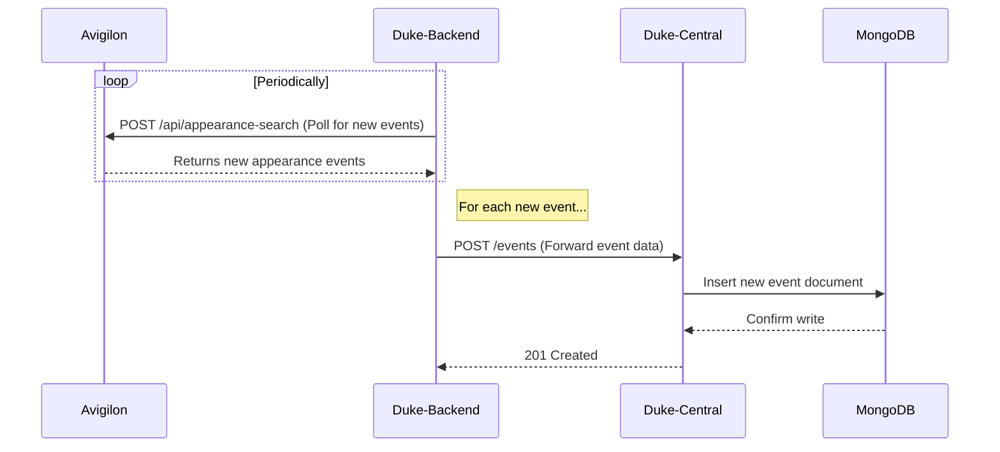
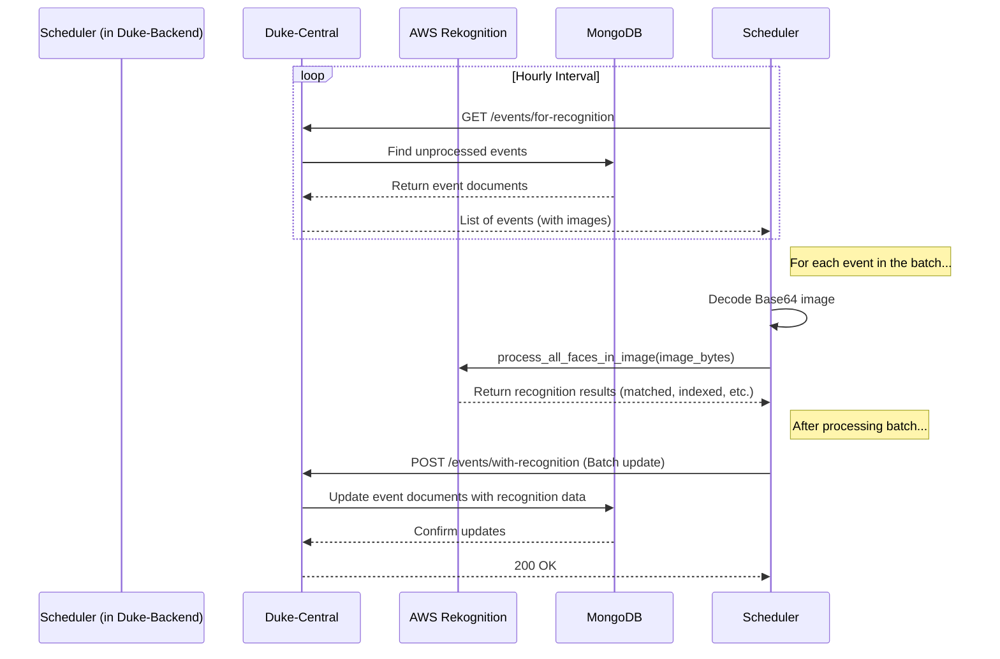

# Duke System: Technical Integration Guide

This document provides a detailed guide on the end-to-end data flow for the Duke system. It outlines how appearance event data is ingested from the Avigilon security system, stored in MongoDB, and processed for facial recognition using AWS Rekognition.

## 1. System Components

The integration involves four primary systems:

*   **Duke-Backend**: A Python FastAPI application that acts as a proxy and data processing service. It is responsible for fetching data from Avigilon and orchestrating the facial recognition process.
*   **Duke-Central**: A Python application with two parts: a FastAPI backend for data persistence and an API layer, and a Streamlit frontend for data visualization.
*   **MongoDB**: The NoSQL database used by `Duke-Central` to store all event and analytics data.
*   **AWS Rekognition**: The cloud-based facial recognition service used to identify and index faces from event images.

## 2. End-to-End Data Flow

The process can be broken down into two main phases: **Data Ingestion** and **Facial Recognition Processing**.

### Phase 1: Data Ingestion and Storage

This phase describes how raw event data from Avigilon is captured and stored.

1.  **Polling for Events**: The `Duke-Backend` service is configured to periodically poll the Avigilon server's REST API (e.g., `/api/appearance-search`) to query for new appearance events since the last check.
2.  **Data Forwarding**: When `Duke-Backend` discovers new events, it extracts the relevant data (including the event timestamp, camera ID, and a Base64-encoded image string). It then forwards this data in a structured format to the `Duke-Central` backend API.
3.  **Data Persistence**: The `Duke-Central` backend receives the event data from `Duke-Backend`. It saves this data as a new document in a dedicated MongoDB collection. At this stage, the document is marked as "unprocessed" for facial recognition.

### Phase 2: Facial Recognition Processing

This phase is orchestrated by a scheduled job within the `Duke-Backend` service. It runs periodically (e.g., hourly) to process stored events that have not yet been analyzed.

1.  **Fetch Unprocessed Events**: The `event_facial_recognition_scheduler` in `Duke-Backend` initiates the process. It sends a request to `Duke-Central`'s `/events/for-recognition` endpoint to retrieve a batch of event documents that are pending recognition.
2.  **Image Processing**: For each event returned:
    *   The scheduler decodes the `imageBaseString` from Base64 into raw image bytes.
    *   It passes these bytes to the `process_all_faces_in_image` function, which communicates with the **AWS Rekognition** service.
3.  **AWS Rekognition Interaction**: The service logic performs the following actions against a pre-configured Rekognition Face Collection:
    *   **Search**: It first attempts to match faces in the image against existing faces in the collection (`SearchFacesByImage`).
    *   **Index**: If a face is detected but not matched, it is indexed and added to the collection (`IndexFaces`), receiving a new unique `FaceId`.
    *   **Status**: The function returns a structured result for each detected face, indicating the `status` (`matched`, `indexed`, `no_face`, or `error`) and the associated `FaceId` and metadata.
4.  **Batch Update**: The scheduler collects the recognition results for all events in the batch. It then sends a single `POST` request to `Duke-Central`'s `/events/with-recognition` endpoint, containing a list of event IDs and their corresponding recognition payloads.
5.  **Finalize Data**: `Duke-Central` receives this batch update. It iterates through the results and updates the corresponding documents in MongoDB, storing the `FaceId`, a timestamp, and the final processing status. The event is now considered "processed".

## 3. Key API Endpoints

The integration relies on the following key API endpoints hosted by `Duke-Central`:

*   `POST /events`
    *   **Consumer**: `Duke-Backend`
    *   **Purpose**: To submit a new, unprocessed appearance event for storage.
*   `GET /events/for-recognition`
    *   **Consumer**: `Duke-Backend`'s facial recognition scheduler.
    *   **Purpose**: To fetch a batch of event documents that have not yet been processed by AWS Rekognition.
*   `POST /events/with-recognition`
    *   **Consumer**: `Duke-Backend`'s facial recognition scheduler.
    *   **Purpose**: To submit a batch of facial recognition results to update the corresponding event documents in the database.

## 4. Configuration and Dependencies

*   **Duke-Backend (`.env`)**: Must be configured with the base URL for the `Duke-Central` service (`CENTRAL_BASE`).
*   **Duke-Central (`.env`)**: Must be configured with the connection string and database name for the MongoDB instance (`MONGODB_BASE`, `MONGODB_DB`).
*   **AWS Credentials**: The `Duke-Backend` service host requires AWS credentials with permissions for Rekognition (`rekognition:SearchFacesByImage`, `rekognition:IndexFaces`, etc.). These are typically configured via standard AWS methods (e.g., IAM role, environment variables, or `~/.aws/credentials`).

